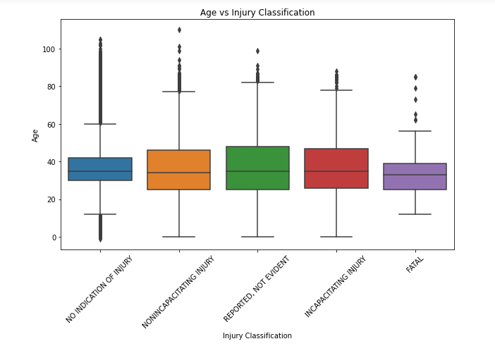
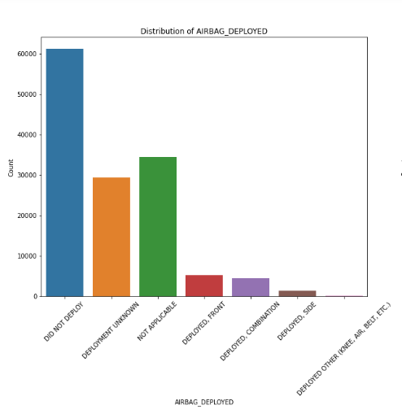
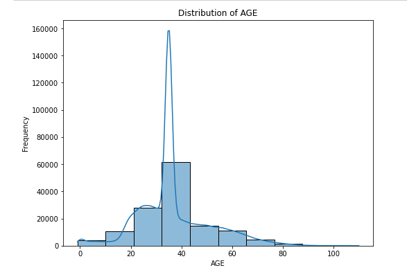
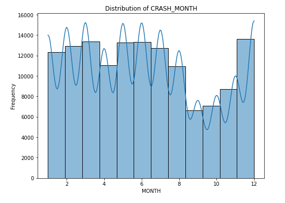
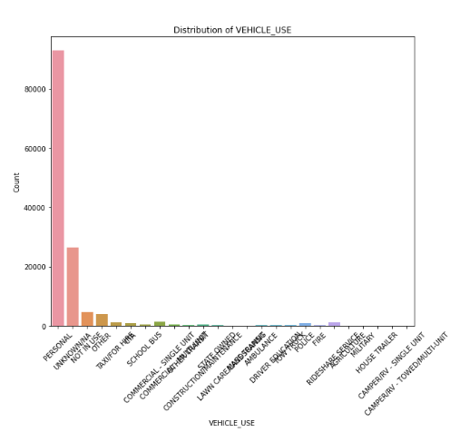
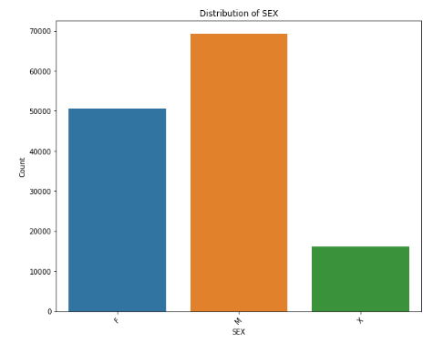
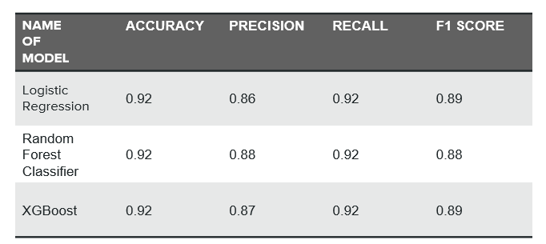

# Car Accident Contributory Cause Classification in Chicago

---

## Introduction

Car accidents are a significant public safety issue and understanding their causes is crucial for implementing effective prevention strategies. This project aims to build a classifier that predicts the primary contributory cause of car accidents in Chicago using data on the people involved, the vehicles and the crash conditions. The insights from this model can help the Vehicle Safety Board and the City of Chicago identify key factors contributing to accidents and take preventive measures to enhance road safety.

---

## Business Understanding

### Overview

The primary goal of this project is to build a classifier that predicts the primary contributory cause of car accidents in Chicago. The target audience includes the Vehicle Safety Board and the City of Chicago, who are interested in reducing traffic accidents and uncovering patterns that lead to accidents.

---

### Challenges

1. **Data Complexity**: The datasets include a wide range of information about people, vehicles, and accidents, making data cleaning and preprocessing challenging.
2. **Class Imbalance**: Some primary contributory causes have very few samples, leading to potential class imbalance issues.
3. **Feature Engineering**: Identifying the most relevant features from a large number of variables requires careful analysis and domain knowledge.

---

### Proposed Solution

- **Metrics**: The primary metric for evaluating the model will be the accuracy score, with a target accuracy of 80%.
- **Other Metrics**: We will also consider precision, recall, and F1 score to get a comprehensive understanding of model performance.

---

### Problem Statement

The goal of this project is to develop a classification model that predicts the primary contributory cause of car accidents in Chicago using data about the people involved, the vehicles, and the crash conditions. This model will help stakeholders understand the factors leading to accidents and implement measures to reduce their occurrence.

---

### Objectives

1. **Data Collection**: Gather and combine datasets related to traffic crashes, people involved, and vehicles.
2. **Data Cleaning and Preparation**: Handle missing values, duplicates, and outliers. Perform necessary data transformations.
3. **Exploratory Data Analysis (EDA)**: Conduct univariate and bivariate analysis to understand the data distribution and relationships.
4. **Modeling**: Build and evaluate multiple classification models, starting with a baseline model and progressing to more complex models.
5. **Evaluation**: Assess model performance using metrics such as accuracy, precision, recall, and F1 score.
6. **Recommendations**: Provide actionable insights and recommendations based on the model's findings.

---

## Data Understanding

### Sources

The datasets used in this project are:
1. **People Dataset**: Information about people involved in crashes.
2. **Vehicle Dataset**: Information about vehicles involved in crashes.

---

## Features
- Detailed analysis of car crash data.
- Visualization of key metrics such as age distribution and airbag deployment.
- Insights on injury classifications and their correlations with other variables.

---

## Data Description
The dataset includes records of car crashes with the following key variables:
- `AGE`: The age of the individuals involved in the crashes.
- `INJURY_CLASSIFICATION`: The classification of injuries sustained in the crashes.
- `AIRBAG_DEPLOYED`: Whether the airbag was deployed during the crash.

The data has been cleaned to remove any null values and inconsistencies.

---

## Visualization
The following visualizations are included in the project:

**Age vs Injury Classification** 

---
**Distribution of Airbag Deployment**

---
**Distribution of Age**

---
**Distribution of Crash Month**

---
**Distribution of Vehicle use**

---
**Distribution of sex**        

---

## Results
Key findings from the analysis include:

- Most car crashes involve individuals aged between 30-40.
- A significant number of crashes do not deploy airbags.
- Incapacitating injuries are more common in the 30-40 age group.
- September, October and November have the least number of car crashes while March, May, June and December have the most.
- Personal vehicles are the most involved in accidents.
- Males are the most involved in car Crashes.

---

## Modelling
To predict injury severity and identify the factors influencing it, we have implemented the following models:

- Logistic Regression as the base model.
- Random Forest Classifier.
- XGBoost classifier.

---

### Model Results
   

---

## Recommendations
- **Target High-Risk Age Groups:** Focus interventions on drivers aged 30 to 40.
- **Seasonal Campaigns:** Increase road safety awareness during high-risk months.
- **Vehicle Maintenance Programs:** Encourage regular maintenance to prevent defects.
- **Policy Implementation:** Address common contributory factors like driver actions and physical conditions.
- **Random Forest Classifier:** This model performed  the best. Thus can be used by the Vehicle Safety Board and the city of Chicago to identify key factors contributing to car accidents and implement measures to reduce their occurrence.

---

## Acknowledgements
- Data Source: Chicago Data Portal.